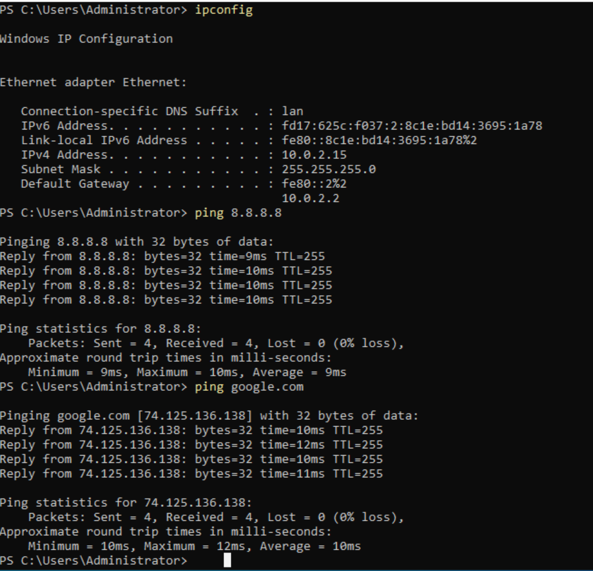
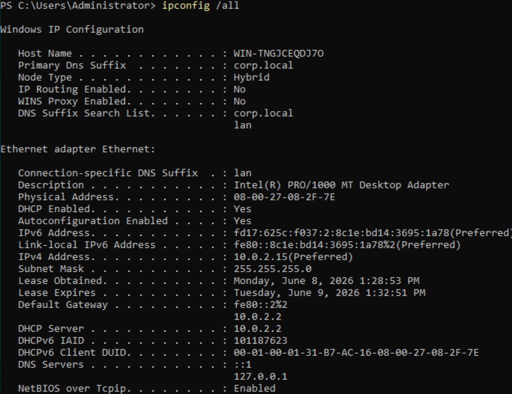
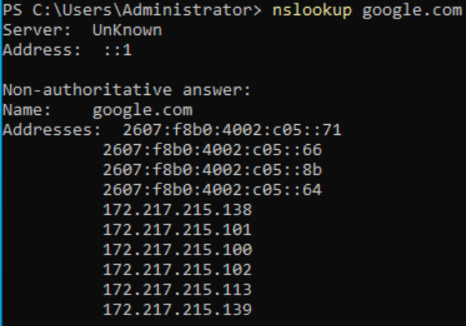
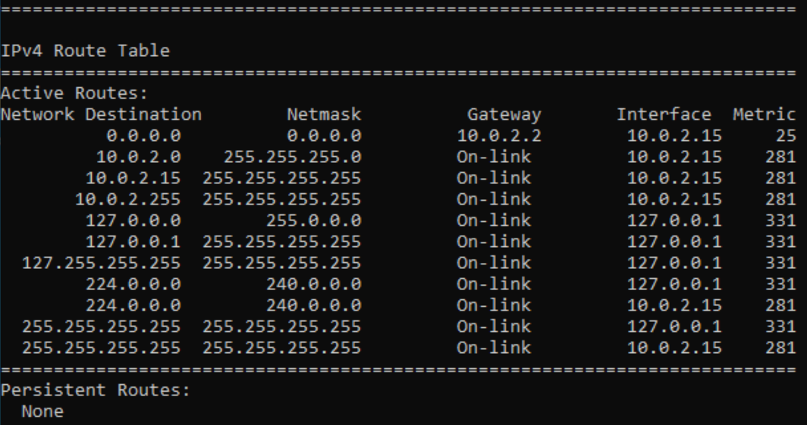
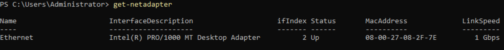
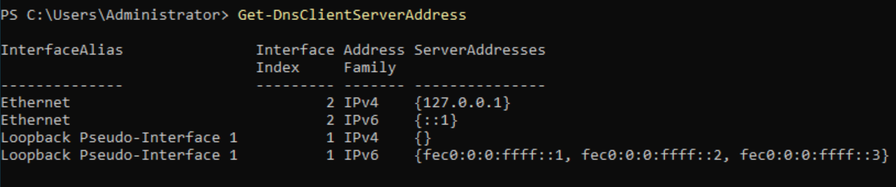
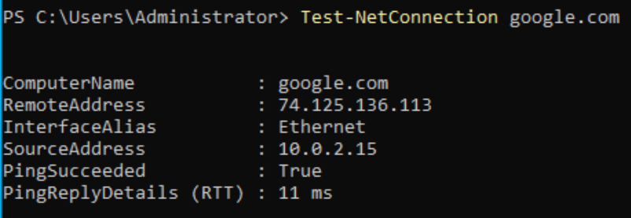
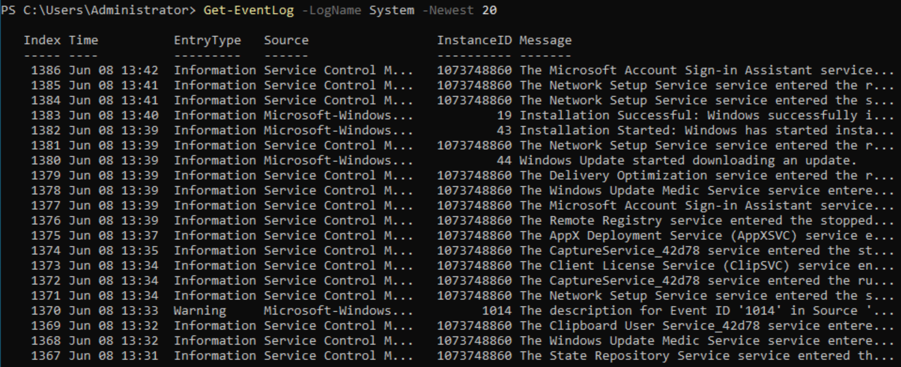
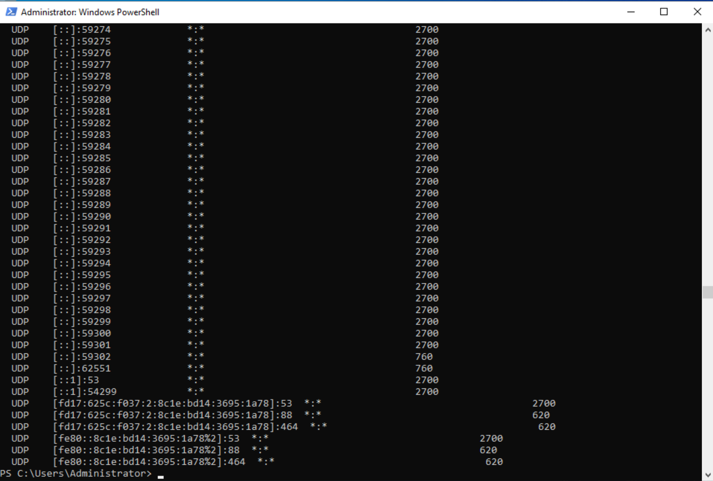
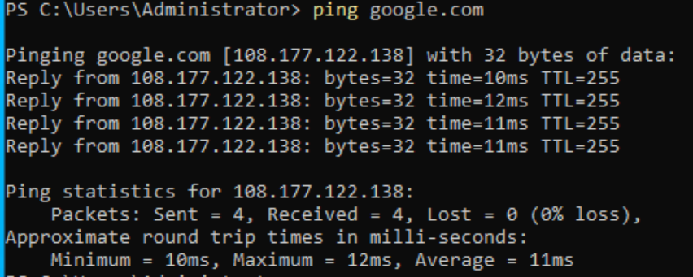

# Windows Server Network Troubleshooting and Connectivity Restoration Lab

## Overview

This project demonstrates a structured troubleshooting methodology used to identify, diagnose, and resolve network connectivity issues in a Windows Server environment.

The lab was performed using Windows Server 2022 running in VirtualBox. A network connectivity issue was intentionally investigated using multiple administrative tools to determine the root cause, validate network services, and restore communication with external resources.

## Technologies Used

* Windows Server 2022
* VirtualBox
* Windows PowerShell
* TCP/IP
* DNS
* Ping
* Nslookup
* Route Table Analysis
* Event Viewer
* Netstat

---

## Identifying the Network Problem

When troubleshooting network issues, administrators first verify whether the system can communicate with external resources.

### Network Connectivity Testing

The first test was performed using both IP-based and hostname-based communication. Successful replies from both 8.8.8.8 and google.com confirmed that network connectivity and DNS resolution were functioning after corrective action was implemented.

Key observations:

* 0% packet loss
* Successful communication with external networks
* Successful hostname resolution
* Normal network latency

---

## Reviewing TCP/IP Configuration

Once connectivity was confirmed, the server's network configuration was reviewed.

### IP Configuration Analysis

The `ipconfig /all` command provides detailed information about the network adapter, including IP addressing, DNS configuration, DHCP information, and default gateway settings.

Key observations:

* IPv4 address assigned successfully
* Valid subnet mask present
* Default gateway configured
* DNS server configuration identified
* DHCP lease information available

This information confirms that the server received proper network settings from the network infrastructure.

---

## Testing DNS Resolution

A common cause of network problems is DNS failure. DNS testing verifies whether hostnames can be translated into IP addresses.

### DNS Name Resolution Validation

The `nslookup` command was used to query Google's DNS records.

Key observations:

* DNS query completed successfully
* Multiple IPv4 addresses returned
* Multiple IPv6 addresses returned
* Hostname resolution functioning properly

Because DNS responses were returned successfully, DNS services were eliminated as the source of the original connectivity issue.

---

## Verifying Network Routing

After confirming IP addressing and DNS functionality, the server routing table was reviewed.

### Route Table Analysis

The routing table determines how traffic leaves the server and reaches other networks.

Key observations:

* Default route (0.0.0.0) present
* Gateway configured as 10.0.2.2
* Local network routes available
* No obvious routing conflicts detected

The presence of a valid default route confirmed that outbound traffic had a path to external networks.

---

## Validating Network Adapter Status

Administrators must verify that the network adapter itself is functioning correctly.

### Network Adapter Verification

The network adapter status was reviewed using PowerShell.

Key observations:

* Ethernet adapter detected
* Adapter operational
* Network connection active
* No adapter failures present

This step confirmed that the issue was not caused by disabled or disconnected hardware.

---

## Reviewing DNS Client Configuration

After validating connectivity and adapter status, DNS client settings were examined.

### DNS Server Configuration

The configured DNS servers determine where hostname resolution requests are sent.

Key observations:

* DNS server entries present
* Valid resolver configuration detected
* DNS requests have a valid destination

This verification confirmed that DNS client settings were configured correctly.

---

## Performing End-to-End Network Testing

The next step was to perform a complete network connectivity test.

### Test-NetConnection Analysis

`Test-NetConnection` provides a more detailed network diagnostic than a standard ping.

Key observations:

* Remote host reachable
* DNS resolution successful
* Network communication successful
* End-to-end connectivity verified

This test confirmed that the server could communicate successfully beyond the local network.

---

## Investigating System Events

Event logs often contain valuable information when diagnosing infrastructure issues.

### System Log Review

The Windows System event log was reviewed to identify recent warnings, errors, or network-related events.

Key observations:

* Recent system events available
* Service activity visible
* No critical networking failures detected during review

Event Viewer provides administrators with historical visibility into operating system activity and service behavior.

---

## Reviewing Active Network Connections

Active network sessions and listening ports were examined.

### Network Service Verification

The `netstat -ano` command displays active connections and listening services.

Key observations:

* DNS services listening on port 53
* Active Directory related services visible
* Network services actively accepting traffic
* No abnormal connection behavior observed

This step confirmed that critical network services were operational.

---

## Verifying Successful Resolution

A final connectivity test was performed after correcting the VirtualBox network configuration.

### Connectivity Restoration

The server successfully communicated with external resources using hostname-based communication.

Key observations:

* Hostname successfully resolved
* Responses received from remote host
* 0% packet loss
* Stable round-trip times

This final validation confirmed that network connectivity had been fully restored.

---

## Root Cause Analysis

The original issue was caused by an incorrect VirtualBox network adapter configuration.

Because the virtual machine was connected to the wrong network type, the server could not obtain valid network connectivity. This resulted in failed communication with external resources.

The network adapter configuration was corrected and the virtual machine was restarted. Once a valid IP address, gateway, and DNS configuration were obtained, connectivity was restored successfully.

---

## Skills Demonstrated

* Windows Server Administration
* Network Troubleshooting
* TCP/IP Analysis
* DNS Troubleshooting
* Route Table Analysis
* Connectivity Testing
* Event Log Analysis
* Root Cause Analysis
* PowerShell Administration
* Virtualization Administration
* Infrastructure Troubleshooting

---

## What I Learned

This project reinforced the importance of following a structured troubleshooting methodology when diagnosing network issues. By validating connectivity, reviewing TCP/IP configuration, testing DNS resolution, examining routing information, investigating event logs, and verifying active services, I gained hands-on experience using the same troubleshooting workflow commonly performed by Systems Administrators in production environments.

